# Manual de Usuario — Planilla Rural

Guía completa para usar la app de carga y control de hacienda en remates.
Escrita para que la pueda seguir cualquier persona, sin conocimientos técnicos.

> **Nota sobre las imágenes:** a lo largo del manual hay marcadores de captura
> (``). Son **espacios reservados** para que pegues las
> capturas de pantalla reales. Sacá la captura, guardala en la carpeta `docs/capturas/`
> con el nombre indicado y la imagen aparecerá sola.

---

## 1. Introducción

### ¿Qué es Planilla Rural?

**Planilla Rural** es una aplicación para **anotar y controlar los lotes de hacienda**
(vacas, novillos, terneros, etc.) durante un **remate** (la venta/feria de ganado).

En lugar de llevar la planilla en papel, con esta app podés:

- Registrar cada **lote** que entra: en qué **corral** está, de quién es (el **remitente**),
  qué categoría de animal es, cuántas cabezas tiene y en qué estado está.
- Sacarle una **foto a la marca** de cada lote.
- Ver un **mapa de los corrales** y darte cuenta de un vistazo cuáles están ocupados y cuáles vacíos.
- **Buscar** un lote rápido, **ordenar** la lista como te convenga.
- **Descargar la planilla en PDF** para imprimir o compartir.

La app está pensada para usarse **desde el celular en el campo o en la feria**, y también
funciona en la computadora.

### ¿Quiénes la usan?

Hay **dos tipos de usuarios**:

- **Operador**: es quien trabaja en el remate. Puede hacer **todo**: crear remates, cargar
  lotes, editarlos, borrarlos, finalizar el remate.
- **Invitado**: solo puede **mirar** (modo "solo lectura"). Ve los lotes, el mapa y puede
  descargar el PDF, pero **no puede modificar nada**.

> El sistema decide qué sos según el usuario con el que entrás. No hay que configurar nada.

---

## 2. Primeros pasos

### Cómo entrar a la app

1. Abrí la dirección de la app en el navegador del celular o de la computadora
   (te la pasa la persona que administra el sistema).
2. Vas a ver la pantalla **"Planilla Rural — Acceso local"**.
3. Escribí tu **Usuario** y tu **Contraseña**.
4. Tocá el botón **Ingresar**.

> **No hay registro propio.** Las cuentas las crea el administrador del sistema. Si no tenés
> usuario o no te anda la contraseña, pedísela a quien administra la app.

**Truco:** al lado de la contraseña hay un botón **"Ver"** que te deja mostrar lo que escribiste,
por si te equivocaste tipeando. Tocalo de nuevo (**"Ocultar"**) para taparla.

### Cómo instalar la app en el celular (PWA)

Planilla Rural es una **PWA**: una página web que se puede **instalar como si fuera una app**.
Una vez instalada, te queda el ícono en la pantalla del celular y se abre a pantalla completa,
sin la barra del navegador.

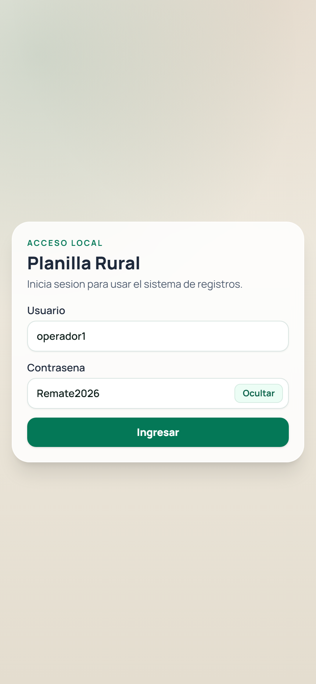

**En Android (Chrome):**

1. Abrí la app en Chrome.
2. Tocá el menú de los **tres puntitos** (arriba a la derecha).
3. Elegí **"Instalar aplicación"** o **"Agregar a pantalla principal"**.
4. Confirmá. Te aparece el ícono de Planilla Rural junto al resto de tus apps.

**En iPhone / iPad (Safari):**

1. Abrí la app en **Safari** (importante: en iPhone tiene que ser Safari).
2. Tocá el botón **Compartir** (el cuadradito con la flecha para arriba).
3. Bajá y elegí **"Agregar a inicio"** / **"Add to Home Screen"**.
4. Tocá **Agregar**. Listo, te queda el ícono en la pantalla.

### ¿Funciona sin internet?

**Sí, en parte.** La app está preparada para aguantar cortes de señal:

- Si **se cae internet y recargás**, la app **te muestra los últimos datos que tenía guardados**
  en vez de quedarse en blanco. Vas a ver el mensaje *"Sin conexión — mostrando datos guardados."*
- **Lo que NO se puede hacer sin internet** es **guardar cambios** (cargar, editar o borrar lotes).
  Si lo intentás, te avisa *"Sin conexión …"* y no se pierde nada, pero tenés que esperar a tener
  señal para guardar.

> En resumen: sin internet podés **mirar**, pero para **modificar** necesitás conexión.

---

## 3. Conceptos básicos (antes de empezar)

Vale la pena tener claras estas palabras, porque toda la app gira alrededor de ellas:

- **Remate**: la jornada de venta de hacienda. Todo lo que cargás "pertenece" a un remate.
  Un remate tiene un nombre, una fecha y un lugar. Puede estar **abierto** (se puede trabajar)
  o **finalizado** (cerrado, solo lectura).
- **Lote**: un grupo de animales que se cargan juntos como una unidad (de un mismo remitente,
  en un mismo corral). Es la "ficha" que vos cargás.
- **Corral**: el lugar físico donde están los animales. Cada corral tiene un número o identificador.
- **Pasillo**: los caminos entre corrales. Normalmente no se usan para guardar hacienda, pero la app
  te deja usarlos como **corrales temporales** si activás esa opción (ver sección 5.9).
- **Toril**: un corral especial (aparece en el mapa marcado como **"TO"**).
- **Remitente**: la persona o establecimiento dueño de los animales de ese lote.
- **Remate activo**: el remate en el que estás trabajando **ahora mismo**. La app siempre trabaja
  sobre uno. Lo elegís vos y queda guardado para la próxima vez que entres.

### Los dos roles, en concreto

| Acción | Operador | Invitado |
|---|---|---|
| Ver lotes, mapa y totales | ✅ | ✅ |
| Buscar y ordenar | ✅ | ✅ |
| Descargar PDF | ✅ | ✅ |
| Cargar un lote nuevo | ✅ | ❌ |
| Editar / borrar lotes | ✅ | ❌ |
| Crear un remate | ✅ | ❌ |
| Finalizar un remate | ✅ | ❌ |

> Si sos invitado, vas a ver los botones igual, pero al tocarlos te avisa que **no tenés permiso**.

---

## 4. Recorrido por pantalla

### 4.1 Pantalla de Ingreso (login)

Es la primera que ves. Solo pide **usuario** y **contraseña**, con el botón **"Ver"** para
mostrar/ocultar la clave y el botón **"Ingresar"**. Mientras entra, el botón muestra
*"Ingresando…"* para que sepas que está trabajando.

### 4.2 Pantalla de Gestión de Remates

Después de entrar (o cada vez que tocás **"Cambiar remate"**), llegás acá. Sirve para
**elegir en qué remate vas a trabajar**.

Tiene tres partes:

1. **Remate seleccionado** (arriba): te muestra cuál tenés elegido ahora, con su estado
   (**Activo** o **Finalizado**) y un botón **"Entrar al sistema"** para ir a la pantalla principal.

2. **Crear un remate nuevo** (solo operadores): un formulario para dar de alta un remate
   (ver tutorial 5.1).

3. **Listado de remates**, dividido en dos columnas:
   - **Remates vigentes**: los que están abiertos. Cada uno tiene:
     - **"Trabajar aquí"** (si sos operador) o **"Observar aquí"** (si sos invitado): lo elige
       como remate activo y te lleva a la pantalla principal.
     - **"Finalizar"** (solo operadores): cierra el remate.
   - **Remates finalizados**: los ya cerrados. Tienen el botón **"Ver remate"** para entrar a
     mirarlos (en modo solo lectura).

Arriba a la derecha hay un botón para **recargar** la página y el botón **"Salir"** (cerrar sesión).

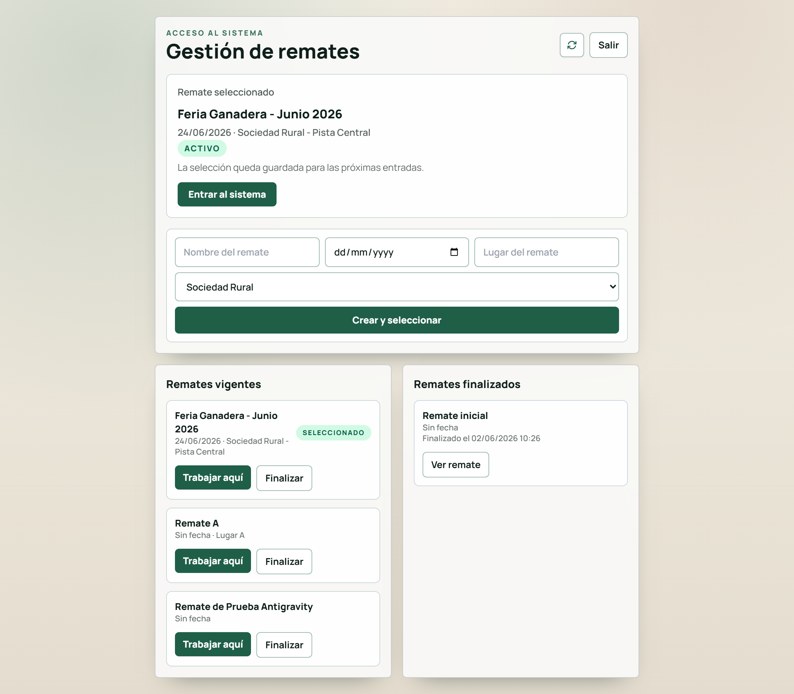

### 4.3 Pantalla principal — pestaña **Registros**

Es el corazón de la app. Abajo de todo (en el celular) hay dos botones para cambiar de pestaña:
**Registros** y **Corrales**.

La pestaña **Registros** tiene dos bloques:

**a) Registrar Ingreso (el formulario de carga)**

Acá cargás un lote nuevo. Los campos son:

- **Corral**: el número/identificador del corral. Podés escribirlo o elegirlo de la lista que se
  despliega. Si el corral ya tiene lotes, aparece un **aviso amarillo** contándote qué hay adentro.
- **Remitente**: el dueño del lote. A medida que escribís, sugiere remitentes ya cargados.
  Si ese remitente ya tiene marcas registradas en este remate, te las muestra para reutilizar.
- **Categoría**: se elige de una lista fija: *Novillo, Novillito, Vaca, Vaca con cría, Ternero,
  Ternera, Ternera/o, Vaquilla, Vaquillita, Toro*.
- **Cantidad (Cabezas)**: el número de animales del lote.
- **Estado de la Hacienda**: se marcan con tilde (se puede más de uno): *Conserva, Invernada normal,
  Invernada buena, Gordo, Para cría*.
- **Foto de Marca**: botón **"Tomar Foto de Marca"** para sacar o elegir la/s foto/s (ver 5.3).
- **Observaciones**: texto libre para cualquier detalle del lote.

Abajo está el botón **"Guardar Registro"** (y **"Cancelar"** cuando estás editando).

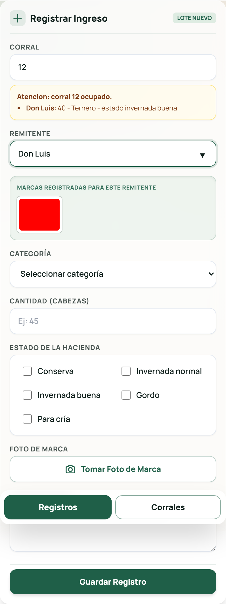

**b) Lista de Lotes**

Muestra todos los lotes cargados en el remate. Incluye:

- Un **Buscador General** (busca por corral, remitente, categoría, estado, observaciones o cantidad).
- Un menú **"Ordenar por"** con varias opciones (corral, ingreso más reciente, cantidad, alfabético).
- El **total de cabezas** de los resultados que estás viendo.
- Las **tarjetas** de cada lote, con sus datos, su foto y los botones para **editar** o **eliminar**.
- El botón **"Descargar PDF"** (ver 5.10).

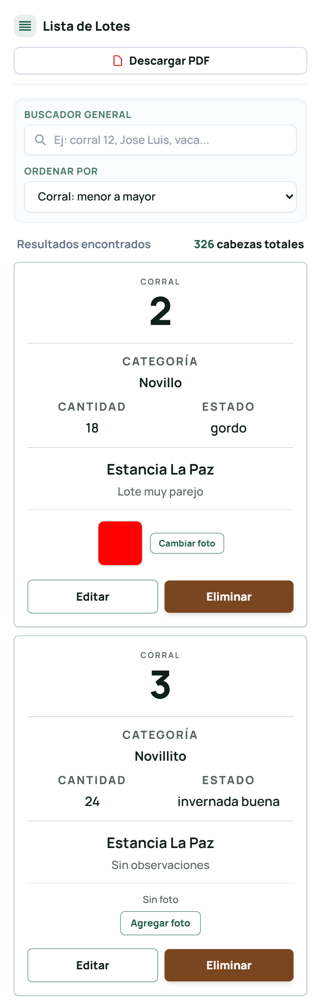

### 4.4 Pantalla principal — pestaña **Corrales**

Es el **mapa de los corrales** del lugar. Sirve para ubicarte visualmente.

- Cada cuadradito es un corral, un pasillo, el toril o la pista.
- Los colores te dicen el estado de cada corral (hay una **referencia de colores** abajo del mapa):
  - **Azul oscuro** = corral **ocupado**.
  - **Azul claro** = corral **vacío**.
  - **Gris** = **pasillo**.
  - **Verde** = **pasillo habilitado** como corral temporal.
  - **Amarillo** = **Toril (TO)**.
- Podés **acercar / alejar** el mapa, **arrastrarlo** y **centrarlo**.
- Al **tocar un corral**, abajo te muestra el **detalle**: qué lotes tiene, cuántos animales en total,
  y los botones para editarlos, cambiarles la foto o borrarlos. También aparece el botón
  **"Nuevo Lote Aquí"** para cargar directo en ese corral.
- Arriba hay una opción **"Habilitar pasillos como corrales temporales"** (ver 5.9).

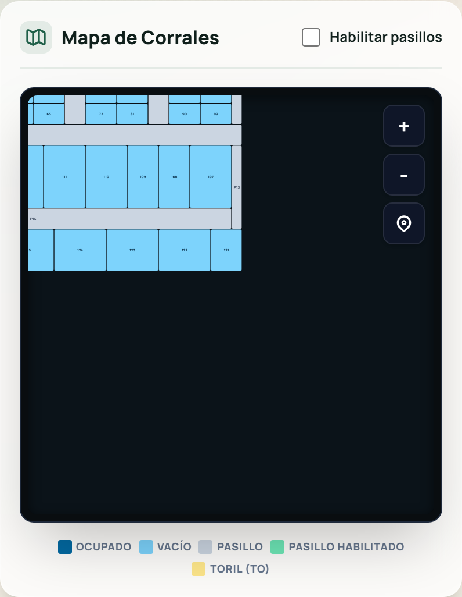

### 4.5 La barra de arriba

Tanto en Registros como en Corrales, arriba de todo tenés una barra oscura con:

- El **nombre del remate activo**, su fecha y lugar.
- El **total de cabezas en corrales** (suma de todo lo cargado).
- Botón de **recargar** la página.
- Botón de **modo escritorio**: reacomoda la pantalla para verla más cómoda en una computadora
  (muestra el formulario, la lista y el mapa al mismo tiempo).
- Botón de **cambiar remate** (te lleva a la pantalla de Gestión de Remates).

Si el remate está **finalizado**, arriba aparece una franja: **"Remate finalizado — solo lectura"**.

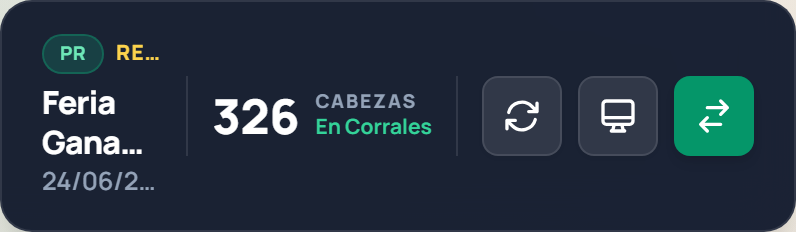

---

## 5. Tutoriales paso a paso

### 5.1 Crear un remate nuevo (solo operadores)

1. Entrá a la app. Si no estás en la pantalla de remates, tocá **"Cambiar remate"** (barra de arriba).
2. En el formulario **"Crear y seleccionar"** completá:
   - **Nombre del remate** (obligatorio). *Si lo dejás vacío, el sistema le pone uno automático con el mes.*
   - **Fecha** (opcional).
   - **Lugar** (opcional).
   - **Mapa** (si hay más de uno disponible para elegir).
3. Tocá **"Crear y seleccionar"**.

El remate queda creado, seleccionado como **activo** y te lleva directo a la pantalla principal,
listo para cargar lotes.

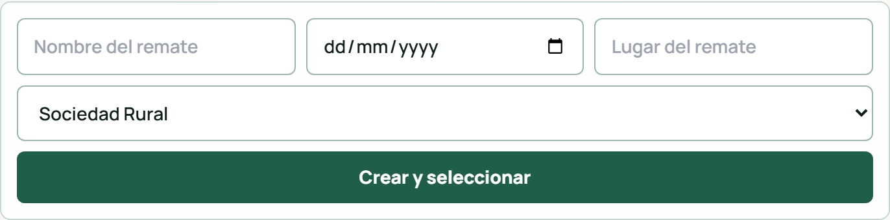

### 5.2 Cargar un lote (con foto de marca)

1. Asegurate de estar en la pestaña **Registros**.
2. Completá el **Corral**. Si ya tiene hacienda, mirá el aviso amarillo (no es un error, es para
   avisarte que ese corral ya tiene algo).
3. Escribí el **Remitente**.
4. Elegí la **Categoría**.
5. Poné la **Cantidad** de cabezas.
6. Marcá el/los **Estado/s** que correspondan.
7. (Opcional) Sacá la **Foto de Marca** (ver 5.3).
8. (Opcional) Escribí **Observaciones**.
9. Tocá **"Guardar Registro"**.

El lote aparece al instante en la **Lista de Lotes** y el corral se actualiza en el mapa.

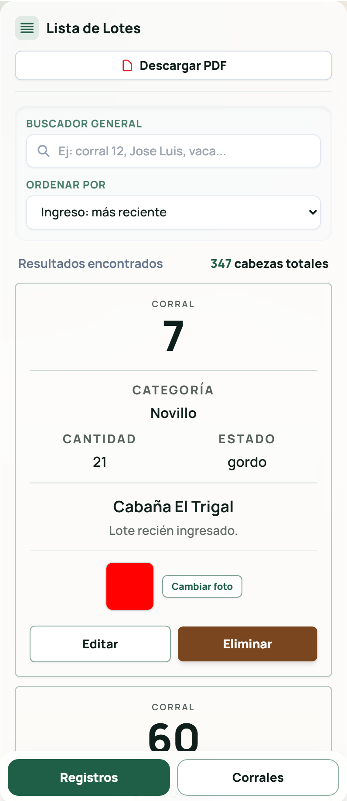

### 5.3 Sacar o elegir la foto de marca

1. Tocá **"Tomar Foto de Marca"**.
2. Según el dispositivo, se abre **la cámara** dentro de la app o el **selector de fotos** del celular.
   - Si se abre la cámara: enfocá la marca y tocá **"Tomar foto"**. Si la cámara no anda, está el botón
     **"Usar archivo"** para elegir una foto de la galería.
3. Podés sacar/elegir **varias fotos** (hasta **5** por lote).
4. Las fotos elegidas aparecen como miniaturas. Si te equivocaste, usá **"Quitar foto(s)"**.
5. Seguí con el resto del formulario y guardá.

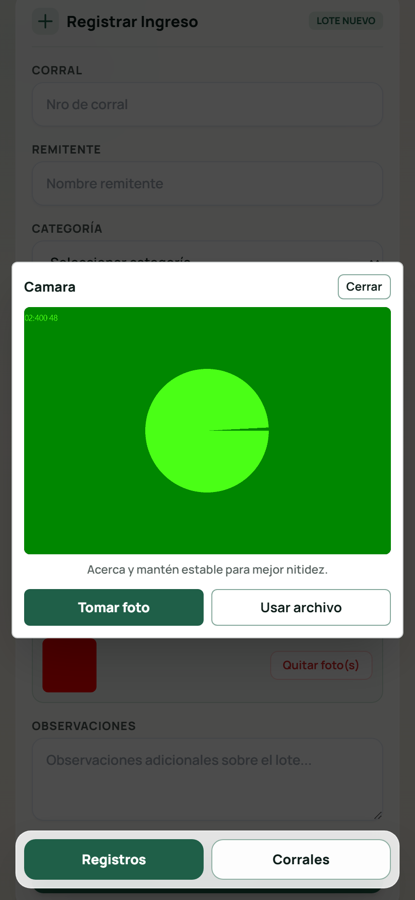

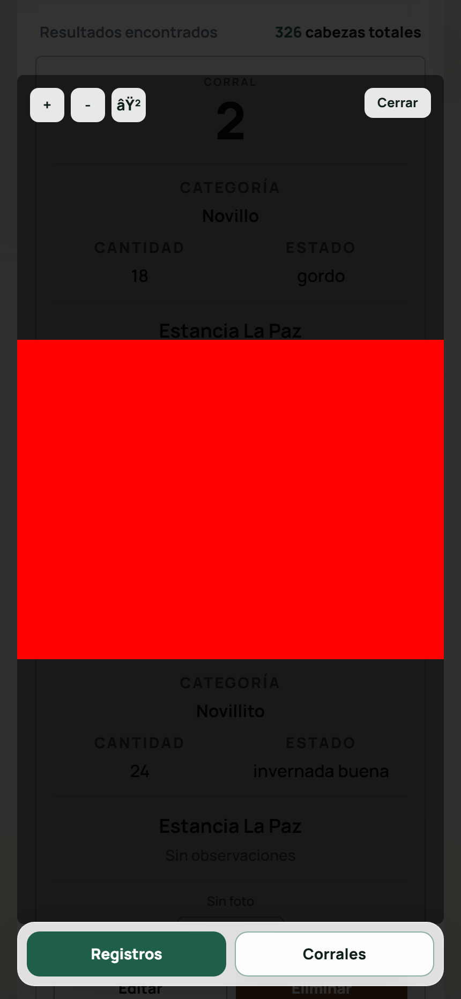

> **Para ver una foto en grande:** tocá la miniatura. Se abre un visor donde podés **acercar, alejar
> y arrastrar** la imagen. Cerralo con el botón **"Cerrar"**.

> **Para agregar o cambiar la foto de un lote ya cargado:** entrá a la pestaña Corrales, tocá el corral
> y usá el botón **"Agregar foto"** / **"Cambiar foto"** en la tarjeta del lote.

### 5.4 Buscar y ordenar lotes

- **Buscar:** escribí en el **Buscador General** lo que quieras encontrar. Funciona con número de
  corral, nombre del remitente, categoría, estado, observaciones o cantidad. La lista se filtra sola.
- **Ordenar:** abrí el menú **"Ordenar por"** y elegí:
  - *Corral: menor a mayor* (por defecto)
  - *Ingreso: más reciente*
  - *Corral: mayor a menor*
  - *Cantidad: mayor a menor* / *menor a mayor*
  - *Alfabético (A-Z)*

> También podés **filtrar por un corral** tocándolo en el mapa: la lista te muestra solo ese corral.
> Para volver a ver todos, usá el botón **"Todos"** (o la etiqueta del corral con la ✕).

### 5.5 Editar un lote (solo operadores)

1. Encontrá el lote en la **Lista de Lotes** (o en el detalle del corral) y tocá **"Editar"**.
2. Se abre una ventana **"Editar lote"** con todos los datos cargados.
3. Cambiá lo que necesites (corral, remitente, categoría, cantidad, estado, observaciones).
4. Tocá **"Guardar cambios"**.

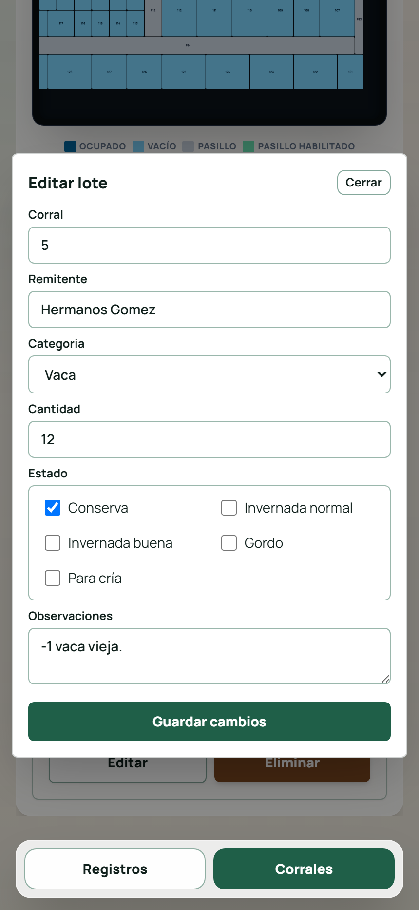

### 5.6 Eliminar un lote (solo operadores)

1. Tocá **"Eliminar"** en el lote que querés borrar.
2. Aparece una ventana de confirmación (**"Confirmar eliminación"**).
3. Tocá **"Eliminar"** para confirmar, o **"Cancelar"** si te arrepentiste.

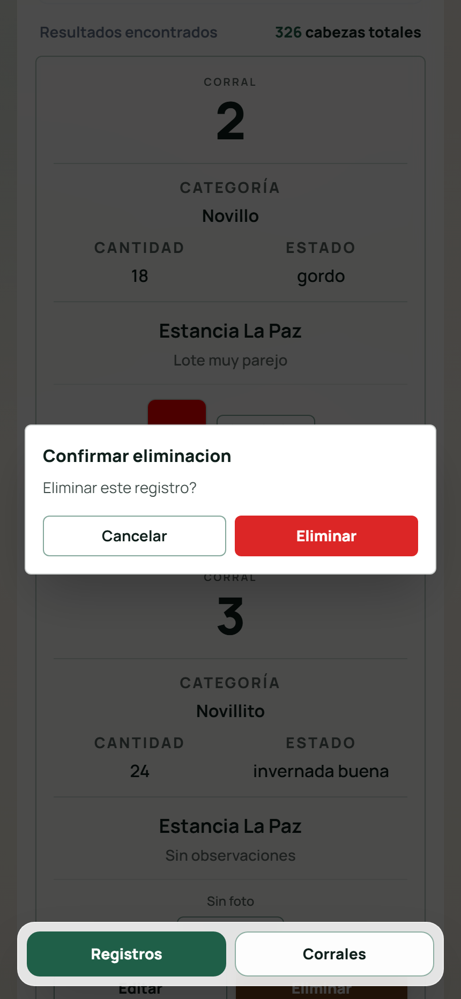

> Ojo: borrar un lote **no se puede deshacer**.

### 5.7 Usar el mapa de corrales

En la pestaña **Corrales**:

- **Moverte por el mapa:** arrastralo con el dedo (o con el mouse).
- **Acercar / alejar:** usá los botones **+** y **−**, o el gesto de pellizcar en el celular,
  o la rueda del mouse.
- **Centrar un corral:** tocá el botón con el ícono de **ubicación** para volver a centrar.
- **Ver qué hay en un corral:** tocalo. Abajo aparece el detalle con sus lotes y totales.
- **Colores:** mirá la referencia debajo del mapa para saber qué está ocupado, vacío, etc.

### 5.8 Cargar un lote directo en un corral desde el mapa

1. En la pestaña **Corrales**, tocá el corral donde querés cargar.
2. En el detalle (o en la barra del corral en modo escritorio), tocá **"Nuevo Lote Aquí"**.
3. Te lleva al formulario con **el corral ya completado**. Llená el resto y **guardá**.

### 5.9 Usar pasillos como corrales temporales

A veces no alcanzan los corrales y se usan los pasillos para acomodar hacienda.

1. En la pestaña **Corrales**, activá la opción **"Habilitar pasillos como corrales temporales"**.
2. Ahora los pasillos (numerados como *Pasillo 1*, *Pasillo 2*, …) se pueden elegir como ubicación
   al cargar o editar un lote.
3. En el mapa, los pasillos habilitados se ven en **verde**.

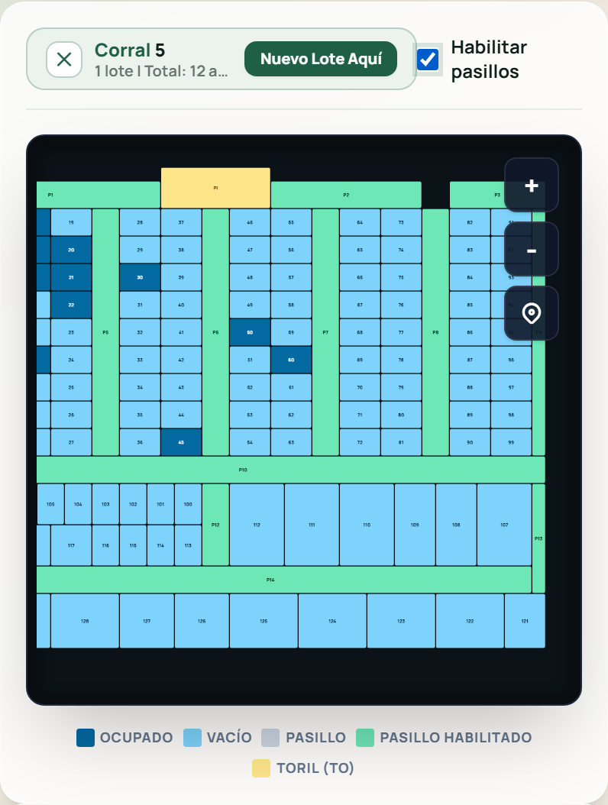

> Si intentás guardar un lote en un pasillo **sin** haber activado esta opción, la app no te deja
> y te avisa que primero tenés que habilitarlos.
> (Solo los operadores pueden activar esta opción.)

### 5.10 Descargar la planilla en PDF

1. En la pestaña **Registros**, tocá **"Descargar PDF"**.
2. Se genera un archivo **PDF apaisado** con el título *"Planilla Rural - Exportación de Corrales"*,
   la fecha y hora, y una tabla con todos los lotes ordenados por corral.
3. La tabla incluye: Corral, Remitente, Categoría, Estado, Cantidad y Observaciones, más dos
   columnas en blanco (**"Corral Nuevo 1"** y **"Corral Nuevo 2"**) y filas vacías de más, pensadas
   para **anotar a mano** durante el remate.
4. El archivo se descarga con un nombre tipo *"Planilla de Corrales 24-6-2026.pdf"*.

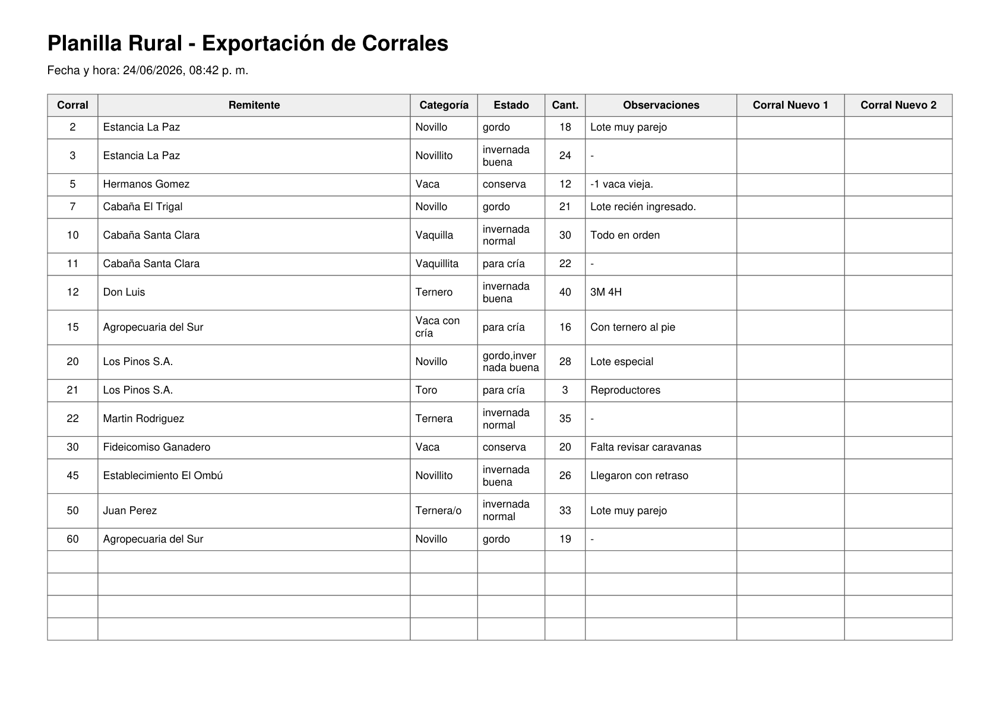

> El PDF lo pueden descargar **todos**, incluidos los invitados.

### 5.11 Cambiar de remate / finalizar un remate

**Cambiar de remate:**

1. Tocá **"Cambiar remate"** en la barra de arriba.
2. En el listado, tocá **"Trabajar aquí"** / **"Observar aquí"** (remates vigentes) o
   **"Ver remate"** (finalizados).

**Finalizar un remate (solo operadores):**

1. En la pantalla de remates, en la columna **"Remates vigentes"**, tocá **"Finalizar"** en el remate
   que querés cerrar.
2. A partir de ahí el remate queda **finalizado** y pasa a **solo lectura**: nadie puede cargar,
   editar ni borrar lotes en él. Igual se puede **mirar** y **descargar el PDF**.

> No encontré una función para **reabrir** un remate finalizado desde la app. Si necesitás eso,
> consultá con quien administra el sistema.

---

## 6. Preguntas frecuentes y problemas comunes

**No me aparece el botón para crear remates / no puedo guardar nada.**
Probablemente entraste como **invitado** (solo lectura). Los botones se ven pero al tocarlos avisan
que no tenés permiso. Pedí un usuario **operador** a quien administra la app.

**Toqué "Guardar" y me dice que el remate está finalizado.**
Ese remate está **cerrado**. No acepta cambios. Cambiá a un remate **vigente** (abierto) para cargar.

**Dice "Sin conexión".**
Te quedaste sin internet. Podés **seguir mirando** los últimos datos, pero **no se pueden guardar
cambios** hasta que vuelva la señal. No perdés lo que ya estaba guardado.

**Me sale "Debes seleccionar un remate".**
No tenés ningún remate activo. Andá a **"Cambiar remate"** y elegí uno (o creá uno si sos operador).

**No me deja guardar un lote en un pasillo.**
Primero activá **"Habilitar pasillos como corrales temporales"** en la pestaña Corrales (solo operadores).

**La foto no se sube / dice que la carga es muy grande.**
Las fotos muy pesadas pueden fallar. Probá sacar **menos fotos por lote** o subirlas de a una.
El máximo es **5 fotos por lote**.

**No me anda la cámara.**
Usá el botón **"Usar archivo"** dentro de la ventana de la cámara para elegir una foto de la galería.
También revisá que el navegador tenga **permiso para usar la cámara**.

**Cargué/edité algo y no lo veo en la lista.**
Tocá el botón de **recargar** de la barra de arriba. La app también se actualiza sola cada tanto.

**Quiero cambiar un lote de corral.**
La forma de hacerlo es **editar el lote** (botón "Editar") y cambiarle el campo **Corral**.
(Ver nota en la sección 8.)

**No me aparece la opción de instalar la app en el celular.**
En iPhone tiene que ser desde **Safari**. En Android, desde **Chrome**, en el menú de los tres puntitos.

---

## 7. Glosario de términos del rubro

- **Remate / Feria:** evento de compra-venta de hacienda.
- **Lote:** conjunto de animales que se venden o manejan juntos como una unidad.
- **Corral:** espacio cerrado donde se guarda la hacienda dentro del predio.
- **Pasillo:** camino entre corrales; en esta app se puede usar como corral temporal.
- **Toril:** corral chico/especial (en el mapa se marca **"TO"**).
- **Pista:** sector del predio (aparece en el mapa como referencia).
- **Remitente:** dueño/establecimiento que envía la hacienda al remate.
- **Marca:** la marca a fuego (o señal) del animal que identifica al dueño; se le saca foto.
- **Cabezas:** forma de contar los animales (cantidad de cabezas = cantidad de animales).
- **Categoría de hacienda:**
  - **Novillo / Novillito:** macho castrado (el "novillito" más joven/liviano).
  - **Vaca / Vaca con cría:** hembra adulta (con su ternero al pie en el segundo caso).
  - **Vaquilla / Vaquillita:** hembra joven que todavía no parió.
  - **Ternero / Ternera / Ternera/o:** cría joven.
  - **Toro:** macho entero (reproductor).
- **Estado de la hacienda:**
  - **Gordo:** animal terminado, listo para faena.
  - **Invernada (normal / buena):** animal para seguir engordando (recría/invernada).
  - **Conserva:** hacienda de descarte / menor terminación.
  - **Para cría:** destinado a reproducción.

---

## 8. Funciones que detecté pero no pude confirmar

Estas cosas aparecen en el código pero **no pude confirmar que estén disponibles para el usuario
final** o que funcionen tal como uno esperaría. Las dejo señaladas para revisar:

- **Mover un lote de corral con un botón "Mover".** El sistema **por dentro** tiene la capacidad de
  mover un lote a otro corral (existe la función en el servidor), pero **no encontré ningún botón ni
  pantalla** que la use. En la práctica, para cambiar un lote de corral hay que **editarlo** y cambiar
  el campo *Corral*. Si se esperaba un botón "Mover" o arrastrar lotes en el mapa, **no está conectado**.

- **Varios mapas / elegir mapa del predio.** Al crear un remate hay un selector de **Mapa**. Esto
  sugiere que puede haber **más de un plano de corrales** (distintos lugares). Funciona si el
  administrador cargó mapas; con un solo mapa, simplemente no hay mucho para elegir. No pude verificar
  cómo se cargan o administran esos mapas desde la app (parece ser tarea del administrador).

- **Categoría "Vaca con cría" al editar.** En el formulario de **carga** aparece la categoría
  *"Vaca con cría"*, pero en la ventana de **edición** de un lote esa opción **no figura** en la lista.
  Si necesitás dejar un lote como *Vaca con cría*, conviene definirlo al **crearlo**.

- **Reabrir un remate finalizado.** Una vez finalizado un remate, no encontré forma de **volver a
  abrirlo** desde la app. Si hace falta, probablemente lo deba hacer el administrador del sistema.

- **Actualización automática de la lista.** La app revisa cambios cada cierto tiempo para refrescar
  los datos, pero si trabajan **varias personas a la vez** puede haber un pequeño retraso hasta que
  veas lo que cargó otro. Ante la duda, usá el botón de **recargar**.

---

*Manual basado en la funcionalidad efectivamente presente en la aplicación. Ante cualquier diferencia
con lo que ves en pantalla, puede que la app haya sido actualizada después de este manual.*
